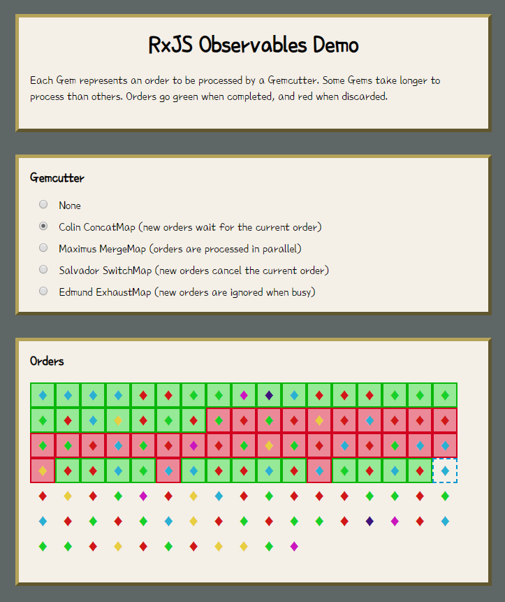

# Observables Demo

A visual demonstration of Observables and the different map operators in RxJS.

This project was generated with [Angular CLI](https://github.com/angular/angular-cli) version 1.7.3.

## Dependencies

Requires [Node.js](https://nodejs.org).

Run `npm install` to install dependencies.

## Run

Run `npm start` and browse to `http://localhost:4200`.
